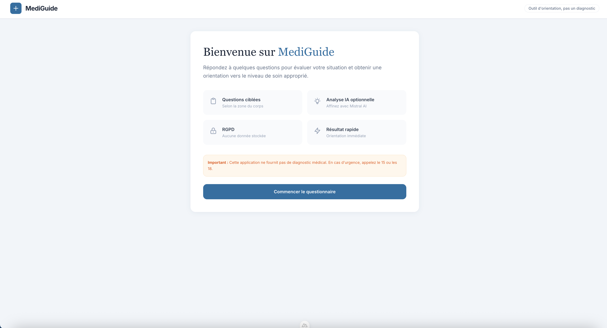
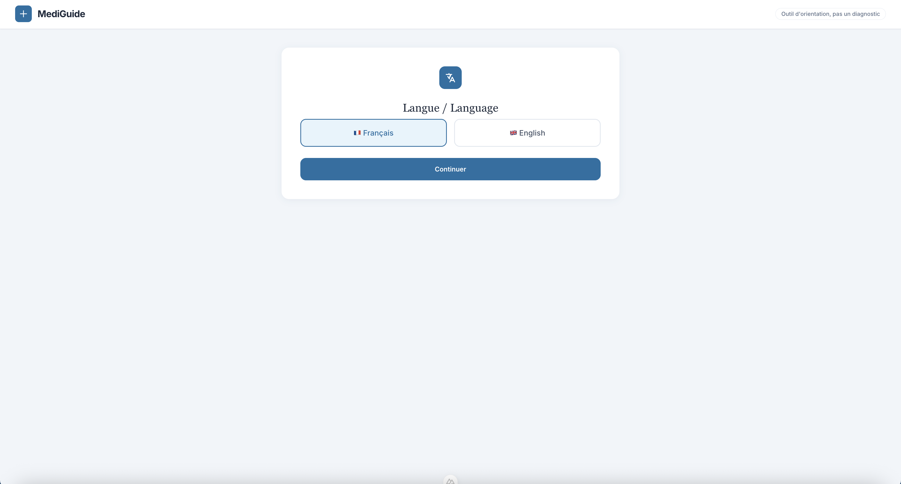
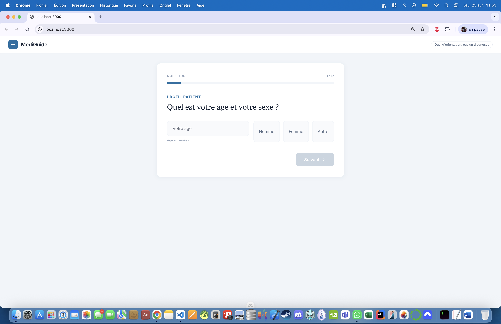
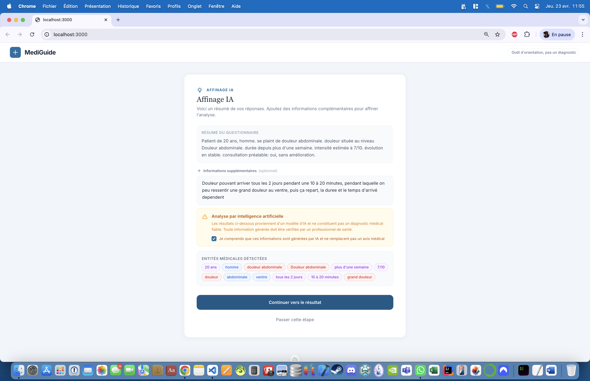
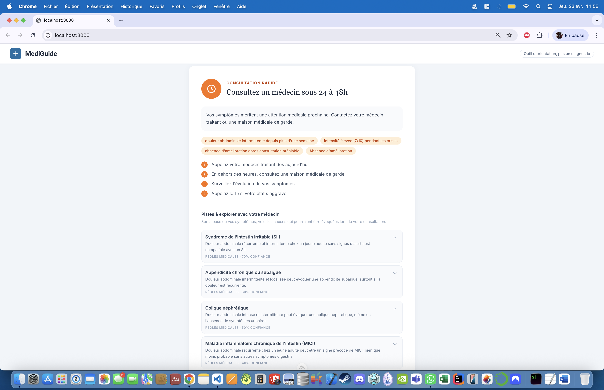

# MediGuide — Application de triage médical

Application web de triage médical permettant d'évaluer la gravité de symptômes et d'orienter l'utilisateur vers le bon niveau de soins.



## Fonctionnalités

- **Questionnaire structuré** - Questions adaptées selon la zone du corps touchée
- **Support multilingue** - Français et Anglais
- **Analyse IA optionnelle** - Affinage avec Mistral AI (avec consentement explicite)
- **Modes de fonctionnement** :
  - **Déterministe** : règles médicales codées (sans IA)
  - **IA** : analyse via Mistral AI
- **Résultats détaillés** :
  - Niveau d'urgence (Urgence / Consultation rapide / Consultation standard)
  - Pistes diagnostiques à explorer
  - Détails expandables pour chaque piste
  - Liens Google pour approfondir
- **Actions** : Copier, Partager, Imprimer les résultats
- **Transparence** : Code source accessible, sources médicales documentées

---

## Étapes de l'application

### 1. Sélection de la langue



Choix entre Français et Anglais.

---

### 2. Écran de bienvenue


Questions structurées avec icônes et options.

---

### 3. Questionnaire



Présentation de l'application et mise en garde importante.


---

### 4. Analyse IA (optionnel)



Analyse avec Mistral AI (si consentement).

---

### 5. Résultat



- Niveau d'urgence avec recommandations
- Pistes à explorer avec détails expandables
- Actions : Copier, Partager, Imprimer

---

## Structure du projet

```
mediguide/
├── pages/
│   └── index.vue               ← Orchestrateur principal
├── components/
│   ├── QuestionCard.vue       ← Affichage des questions
│   ├── QuizRecap.vue           ← Résumé + consentement IA
│   ├── FreeTextAnalyzer.vue    ← Analyse NLP (consentement + analyse)
│   └── TriageResult.vue        ← Résultat avec actions
├── composables/
│   ├── useLocale.ts            ← Gestion FR/EN + traductions
│   ├── useQuestionnaire.ts     ← Questions (bilingue)
│   └── useTriage.ts            ← Logique déterministe
├── server/api/
│   ├── analyze.post.ts         ← Analyse NLP (non utilisé actuellement)
│   └── triage.post.ts          ← Orientation complète (règles + IA Mistral)
├── types/
│   └── index.ts                ← Interfaces TypeScript
└── ...
```

## Installation & Lancement

### 1. Installer les dépendances

```bash
npm install
```

### 2. Configurer l'environnement

```bash
cp .env.example .env
# Ajouter MISTRAL_API_KEY pour l'analyse IA
```

### 3. Lancer en développement

```bash
npm run dev
```

L'application sera accessible sur : **http://localhost:3000**

### 4. Build production

```bash
npm run build
node .output/server/index.mjs
```

## Technologies

| Composant       | Technologie                     |
|-----------------|----------------------------------|
| Framework       | Nuxt 4 (Vue 3 + Composition API)|
| CSS             | Tailwind CSS v3                 |
| IA              | Mistral AI (mistral-large-latest)|
| API             | Nuxt Server Routes (Nitro)      |
| Types           | TypeScript                      |
| Fonts           | DM Sans + DM Serif Display      |

## Architecture API

| Route            | Méthode | Description                        |
|------------------|---------|------------------------------------|
| `/api/analyze`   | POST    | Analyse NLP (legacy)               |
| `/api/triage`    | POST    | Orientation complète (règles + IA) |

## Flux utilisateur

1. **Langue** - Sélection FR ou EN
2. **Bienvenue** - Présentation de l'app
3. **Questionnaire** - Questions structurées
4. **Récapitulatif** - Vérification + consentement IA
5. **Analyse IA** (optionnel) - Affinage avec Mistral AI
6. **Résultat** - Niveau d'urgence + pistes + actions

## Modes de fonctionnement

### Sans IA (déterministe)
- L'utilisateur clique "Obtenir mon résultat directement"
- Utilise uniquement les règles codées (`computeLocal`)
- Pas d'appel API externe

### Avec IA
- L'utilisateur consent à l'analyse IA
- Envoi à l'API Mistral pour affiner les pistes
- Fallback automatique en mode règles si erreur

## Sources des pistes diagnostiques

- **Règles médicales** : Codées en dur dans `server/api/triage.post.ts` → `computeRulesPistes()`
- **Analyse IA** : Viennent de l'API Mistral AI (si consentement)

Chaque piste inclut :
- Durée typique
- Principes de traitement
- Quand consulter
- Signes d'alerte
- Lien de recherche Google

## Notes importantes

- Cette application ne fournit pas de diagnostic médical
- Les résultats sont indicatifs et basés sur les déclarations de l'utilisateur
- En cas d'urgence, appeler le 15 (SAMU) ou le 18 (Pompiers)
- Code source disponible sur GitHub
